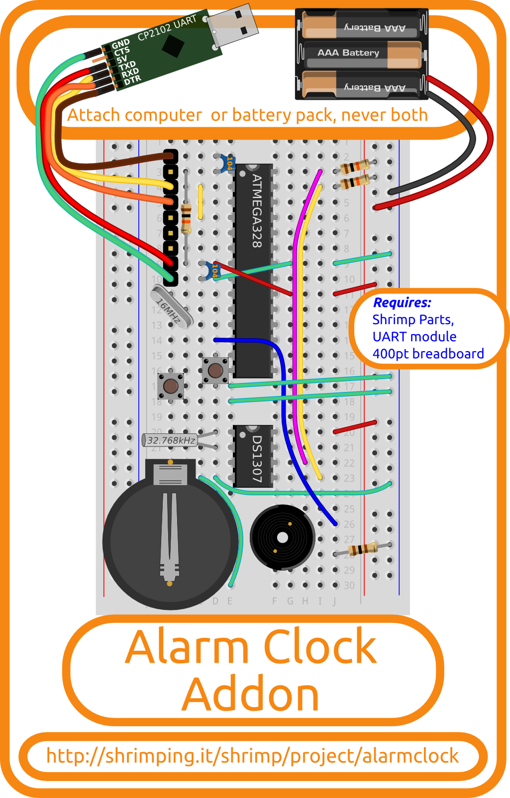

# Alarm Clock Addon kit

The *Alarm Clock Addon* is a pre-bagged kit containing the extra components needed to for our @ShrimpingIt [Alarm Clock](../project/alarmclock/) project. This is a breadboard circuit which can be programmed to run on very low power, keeping accurate time, controlling melody chimes or your choice of time display.

The Addon combines with the @ShrimpingIt kits described below (or equivalent parts) enabling learners to follow our [step-by-step wiring guide](../project/alarm/build.html), and then to upload our [software examples](../project/alarm/program.html) using the free Arduino IDE.

## Kits and Bundles

If you already have the @ShrimpingIt core parts, the Alarm Clock Addon is just £1.00.

It costs £10.30 to buy a bundle with everything needed for this project through our [retail bagging service](../bagging.html) which includes...

* The ***Alarm Clock Addon*** kit comprising...
	* A DS1307 [Real Time Clock chip]()
	* A 32.768kHz [ Crystal]()
	* A ~12mm housed [ Piezoelectric transducer]()
	* 2 Two-pin [Tactile Switches]()
	* A CR2032 [Lithium Watch Battery]()
	* A CR2032-compatible [Watch Battery holder]()
	* A 100Ω [1/2 Watt resistor]()
	* 2x 10kΩ [1/2 Watt resistors]()
	* 5xGreen 2xRed 2xYellow 1xPurple 1xBlue stripped [22AWG solid core wire]()
* A [400point Breadboard](breadboard400.html) (to build the circuit on)
* A [Shrimp Parts](shrimp.html) kit (microcontroller and supporting parts)
* A [UART](cp2102.html) kit (for uploading programmed behaviours to your Shrimp)

See the [pathways map](/#kit) for a pricing breakdown and to find accessories to build other [@ShrimpingIt projects](/#project) reusing the same components.