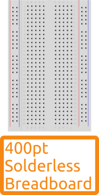

<form style="display:inline;" target="paypal" action="https://www.paypal.com/cgi-bin/webscr" method="post"><input type="hidden" name="cmd" value="_s-xclick"/><input type="hidden" name="hosted_button_id" value="4XZZ524XPNSW6"/><input type="image" src="https://www.paypalobjects.com/en_GB/i/btn/btn_cart_SM.gif" border="0" name="submit" alt="PayPal – The safer, easier way to pay online."/></form><form style="display:inline;" target="_blank" action="https://www.paypal.com/cgi-bin/webscr" method="post" ><input type="hidden" name="cmd" value="_s-xclick"/><input type="hidden" name="encrypted" value="-----BEGIN PKCS7-----MIIG1QYJKoZIhvcNAQcEoIIGxjCCBsICAQExggEwMIIBLAIBADCBlDCBjjELMAkGA1UEBhMCVVMxCzAJBgNVBAgTAkNBMRYwFAYDVQQHEw1Nb3VudGFpbiBWaWV3MRQwEgYDVQQKEwtQYXlQYWwgSW5jLjETMBEGA1UECxQKbGl2ZV9jZXJ0czERMA8GA1UEAxQIbGl2ZV9hcGkxHDAaBgkqhkiG9w0BCQEWDXJlQHBheXBhbC5jb20CAQAwDQYJKoZIhvcNAQEBBQAEgYCq89dLrxB1HdyR6CoVhllTaq4plZpEIsqwkLNfXsMg1Ose5Fmi9LT1ByTk4oWbWt55SFFAEpzL2HSLVf7PVJMahhfIHTwpjgmWWo8VS/dBc9BJmOoECjup2Q04FsNfYI0oKgoQ8MRxGWyG+Lyd9wNCklqODhfdat8Uusyn0L/ZFjELMAkGBSsOAwIaBQAwUwYJKoZIhvcNAQcBMBQGCCqGSIb3DQMHBAiiVKJuaCsc5YAwC4leIIOXv8Loi2f8czHrHY4llMIUAphK12oZqWLvtpRkc0xWZwTD7dpWg/gx115loIIDhzCCA4MwggLsoAMCAQICAQAwDQYJKoZIhvcNAQEFBQAwgY4xCzAJBgNVBAYTAlVTMQswCQYDVQQIEwJDQTEWMBQGA1UEBxMNTW91bnRhaW4gVmlldzEUMBIGA1UEChMLUGF5UGFsIEluYy4xEzARBgNVBAsUCmxpdmVfY2VydHMxETAPBgNVBAMUCGxpdmVfYXBpMRwwGgYJKoZIhvcNAQkBFg1yZUBwYXlwYWwuY29tMB4XDTA0MDIxMzEwMTMxNVoXDTM1MDIxMzEwMTMxNVowgY4xCzAJBgNVBAYTAlVTMQswCQYDVQQIEwJDQTEWMBQGA1UEBxMNTW91bnRhaW4gVmlldzEUMBIGA1UEChMLUGF5UGFsIEluYy4xEzARBgNVBAsUCmxpdmVfY2VydHMxETAPBgNVBAMUCGxpdmVfYXBpMRwwGgYJKoZIhvcNAQkBFg1yZUBwYXlwYWwuY29tMIGfMA0GCSqGSIb3DQEBAQUAA4GNADCBiQKBgQDBR07d/ETMS1ycjtkpkvjXZe9k+6CieLuLsPumsJ7QC1odNz3sJiCbs2wC0nLE0uLGaEtXynIgRqIddYCHx88pb5HTXv4SZeuv0Rqq4+axW9PLAAATU8w04qqjaSXgbGLP3NmohqM6bV9kZZwZLR/klDaQGo1u9uDb9lr4Yn+rBQIDAQABo4HuMIHrMB0GA1UdDgQWBBSWn3y7xm8XvVk/UtcKG+wQ1mSUazCBuwYDVR0jBIGzMIGwgBSWn3y7xm8XvVk/UtcKG+wQ1mSUa6GBlKSBkTCBjjELMAkGA1UEBhMCVVMxCzAJBgNVBAgTAkNBMRYwFAYDVQQHEw1Nb3VudGFpbiBWaWV3MRQwEgYDVQQKEwtQYXlQYWwgSW5jLjETMBEGA1UECxQKbGl2ZV9jZXJ0czERMA8GA1UEAxQIbGl2ZV9hcGkxHDAaBgkqhkiG9w0BCQEWDXJlQHBheXBhbC5jb22CAQAwDAYDVR0TBAUwAwEB/zANBgkqhkiG9w0BAQUFAAOBgQCBXzpWmoBa5e9fo6ujionW1hUhPkOBakTr3YCDjbYfvJEiv/2P+IobhOGJr85+XHhN0v4gUkEDI8r2/rNk1m0GA8HKddvTjyGw/XqXa+LSTlDYkqI8OwR8GEYj4efEtcRpRYBxV8KxAW93YDWzFGvruKnnLbDAF6VR5w/cCMn5hzGCAZowggGWAgEBMIGUMIGOMQswCQYDVQQGEwJVUzELMAkGA1UECBMCQ0ExFjAUBgNVBAcTDU1vdW50YWluIFZpZXcxFDASBgNVBAoTC1BheVBhbCBJbmMuMRMwEQYDVQQLFApsaXZlX2NlcnRzMREwDwYDVQQDFAhsaXZlX2FwaTEcMBoGCSqGSIb3DQEJARYNcmVAcGF5cGFsLmNvbQIBADAJBgUrDgMCGgUAoF0wGAYJKoZIhvcNAQkDMQsGCSqGSIb3DQEHATAcBgkqhkiG9w0BCQUxDxcNMTUwNTI1MDkzODQwWjAjBgkqhkiG9w0BCQQxFgQUglnra9z7F5Zy9Ois1b1hqZ+mhEgwDQYJKoZIhvcNAQEBBQAEgYAWFAniCOqs+diHC2ERqi7oVaImsduLYIAZWloYZnhn00gSG86kYu2orGwF4ZJ8v3fuSDh9GiFdjQ222x0ULcz/NZ3B17NmCsWybcNlldo/mg2nFW3ZoK5Is++cW0WwMgMi6OIvCTEvtu526Y9SmhzAstKjblCtJX9dxOM13f5wgg==-----END PKCS7-----"/><input type="image" src="https://www.paypalobjects.com/en_GB/i/btn/btn_viewcart_SM.gif" border="0" name="submit" alt="PayPal – The safer, easier way to pay online."/></form>
 

# 400 Point Solderless Breadboard

This is the breadboard used as the core of our [Persistence of Vision](../project/pov/build.html),[Alarm Clock](../project/alarmclock/build.html) and [Conductive Keyboard](../project/keyboard/build.html) projects. There is an introduction to the logical structure of this breadboard at the beginning of the [Blink build](http://start.shrimping.it/project/blink/build.html#step2).

## Sourcing

The component and wholesaler information for this project are linked below. Click the ***Add To Cart*** button above for supply through our [retail bagging service](../kit/) to avoid the hassle of self-sourcing.

The helpful Peggy from [NBEverest](http://www.nbeverest.com/) provides us with both the 400 point breadboards and [170 point breadboards](breadboard170.html) that we use in our kits.