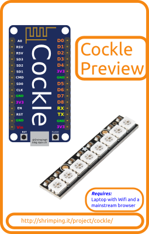

<form target="paypal" action="https://www.paypal.com/cgi-bin/webscr" method="post">
<input type="hidden" name="cmd" value="_s-xclick">
<input type="hidden" name="hosted_button_id" value="MJYRBQ7L7Q4X6">
<table>
<tr><td><input type="hidden" name="on0" value="Cockle pre-flashed with Micropython including...">Cockle pre-flashed with Micropython including...</td></tr><tr><td><select name="os0">
	<option value="Cockle Bundle - USB Cable, 8-light NeoPixel and connector">Cockle Bundle - USB Cable, 8-light NeoPixel and connector £12.50 GBP</option>
	<option value="Cockle with USB Cable">Cockle with USB Cable £8.50 GBP</option>
	<option value="Cockle only">Cockle only £7.50 GBP</option>
</select> </td></tr>
</table>
<input type="hidden" name="currency_code" value="GBP">
<input type="image" src="https://www.paypalobjects.com/en_GB/i/btn/btn_cart_SM.gif" border="0" name="submit" alt="PayPal – The safer, easier way to pay online!">

</form>
 

# Cockle Preview

Introducing Vanguard - a pre-flashed ESP8266 breakout board running python for use in classrooms and hackspaces. 
It is based on the widely available NodeMCU breakout board, preflashed with our own build of Micropython, with helpful supporting libraries, including a python shell you can connect to from your laptop over Wifi or Serial. The Vanguard bundle includes the *Vegas add-on*, (a strip of 8 flashing rainbow pixels), a handful of crocodile clip adaptors for component experimentation, and a battery pack with switch.

The *Persistence of Vision Addon* is a pre-bagged kit containing the extra components you need to complete our @ShrimpingIt [Persistence of Vision](../project/pov/) project, a breadboard circuit which can be programmed to paint text and icons in the air as you wave it.

The Addon combines with the @ShrimpingIt kits described below (or equivalent parts) enabling learners to follow our [step-by-step wiring guide](../project/pov/build.html), and then to upload our [software examples](../project/pov/program.html) using the free Arduino IDE.

## Sourcing Kits and Bundles 

The component and wholesaler information for this project are linked below. Click the ***Add To Cart*** button above for pre-bagged kits from our [retail bagging service](../kit/) to avoid the hassle of self-sourcing.

Our £1.85 ***Persistence of Vision Addon*** includes...
* 8 [Red LEDs](http://www.taydaelectronics.com/led-5mm-red-water-clear-ultra-bright.html)
* A [3xAAA battery box with switch](http://www.rapidonline.com/Electrical-Power/Battery-Box-3-X-AAA-with-Switch-18-2901)

Our £11.75 ***Persistence of Vision Bundle*** includes...

* The ***Persistence of Vision Addon*** listed above...
* A [400point Breadboard](breadboard400.html) (to build the circuit on)
* A [Shrimp Parts](shrimp.html) kit (microcontroller and supporting parts) 
* A [UART](cp2102.html) kit (for uploading programmed behaviours to your Shrimp)

See the [pathways map](/#kit) for a pricing breakdown and to find accessories to build other [@ShrimpingIt projects](/#project) reusing the same components.
