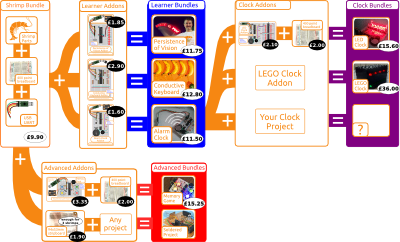

# @ShrimpingIt programmable electronics kits

@ShrimpingIt freely documents incredibly low-cost Arduino-compatible programmable electronics projects designed for learners and educators. 

All our [projects](/#project) have step-by-step guides detailing how to wire the circuits and upload behaviours, see guides for [The Shrimp](../project/shrimp/build.html), [Persistence of Vision](../project/pov/build.html), [Conductive Keyboard](../project/keyboard/build.html), [Alarm Clock](../project/alarmclock/build.html), [Memory Game](../project/memory/build.html), [LED Clock ](../project/ledclock/build.html)

Sourcing information can be found under ***Kits*** at the top of each page. Direct links are below with a summary of each project. 

* [Shrimp Parts](shrimp.html); substitutes for an Arduino Uno - the foundation for our programmable projects
* [Persistence of Vision Addon](pov.html); paint your name in lights - just 8 LEDs and a battery pack
* [Conductive Keyboard Addon](keyboard.html); an affordable <a href="https://www.youtube.com/watch?v=rfQqh7iCcOU" target="_blank">MakeyMakey</a> substitute to invent interactive games
* [Alarm Clock Addon](alarmclock.html); an accurate clock with backup coin battery for long-lived time-controlled projects such as alarms, daily automation, practical jokes or data logging
* [Memory Game Addon](memory.html); backlit buttons, a beeper for melody games like M.B. Games' Simon
* [LED Clock Addon](ledclock.html); an illuminated time display, showing how to extend the [Alarm Clock Addon](../project/alarmclock/build.html) circuit
* [Stripboard Addon](stripboard.html); to transfer breadboard builds to soldered copper circuits

# Designed for Education

The <a href="../style/brand/combinations.png" target="_blank" >pathways map</a> is provided for educators to select different combinations of kits for term projects and lesson plans. Parts are deliberately reusable between projects. Once each learner has a Shrimp Bundle and a suitable breadboard, additional builds are often literally pocket-money prices. The 'Bundle Price' shown on each kit page assumes you have no Shrimp components yet, and includes everything needed to complete the build from scratch.

We invite you to source your own kits if you wish but pre-bagged retail kits are also available to avoid [sourcing hassle and delays](sourcing.html). If you choose to buy kits from us, it helps to support our design work. Components are prepared and combined with color graphic printouts in our distinctive pink anti-static bags in Morecambe, UK before shipping at cost to customers in UK, Europe and the US.

## Our Pricing

@ShrimpingIt project designs are built around widely-available affordable electronics prototyping components from wholesale electronics suppliers. Ours is an open procurement project, providing full information of components, wholesale suppliers and pricing.Our retail prices are 200% of the wholesale sourcing cost, plus 200% of the UK [living wage](http://www.livingwage.org.uk/) for our packing labour per kit.

Using ATmega chips in solderless breadboard maintains Arduino-compatibility, whole avoiding the costs of official Arduino boards, making programmable electronics projects a fraction of the price.

By making programmable electronics radically affordable, @ShrimpingIt hopes every learner can take home their own project to remix and experiment, as a gateway to the tens of thousands of amazing Arduino projects already documented online.