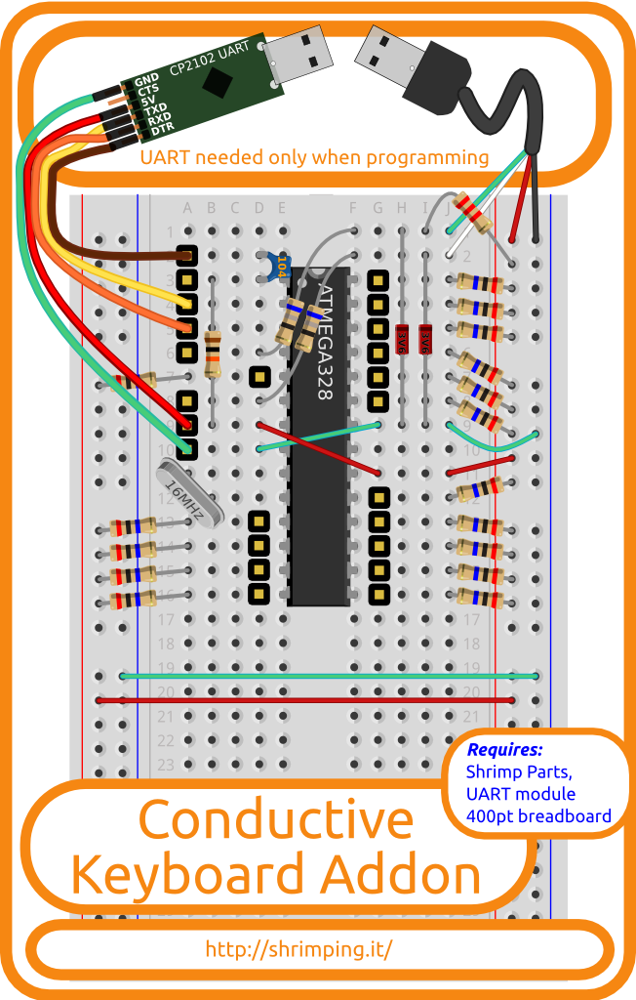

The *Conductive Keyboard Addon* is a pre-bagged kit containing the special components needed for our @ShrimpingIt [Conductive Keyboard](../project/keyboard/) project, supporting our [step-by-step wiring guide](../project/keyboard/build.html), [software examples](../project/keyboard/program.html) and other resources.

## Project Bundle

To make the project, you need to buy the following @ShrimpingIt kits (or equivalent parts)...

* A *Conductive Keyboard Addon* kit
* A [400point Breadboard](breadboard400.html) (to build the circuit on)
* A [Shrimp Parts](shrimp.html) kit (microcontroller and supporting parts) 
* A [UART](cp2102.html) kit (for uploading programmed behaviours to your Shrimp)

A complete bundle for the Conductive Keyboard project costs £11.30 according to the standard [pricing scheme](../bagging.html) for our bagging service. 

See the [pathways map](/#kit) to see how parts of the bundle can be reused in other projects.

# Conductive Keyboard Addon Kit

The *Conductive Keyboard Addon* is a pre-bagged kit containing the extra components needed to for our @ShrimpingIt [Conductive Keyboard](../project/keyboard/) project. This is a breadboard circuit which can behave like a <a href="https://www.youtube.com/watch?v=rfQqh7iCcOU" target="_blank">MakeyMakey</a> detecting touch through conductive objects like bananas or graphite pencil marks on paper, and generating USB keyboard events on a computer.

The Addon combines with the @ShrimpingIt kits described below (or equivalent parts) enabling learners to follow our [step-by-step wiring guide](../project/keyboard/build.html), and then to upload our [software examples](../project/keyboard/program.html) using the free Arduino IDE.

## Kits and Bundles

If you already have the @ShrimpingIt core parts, the Conductive Keyboard Addon is just £2.00.

It costs £10.30 to buy a bundle with everything needed for this project through our [retail bagging service](../bagging.html) which includes...

* The ***Conductive Keyboard Addon*** kit comprising...
	* A [Male A USB adaptor](http://www.aliexpress.com/snapshot/6185231618.html?orderId=63371914879252)
	* 2x [3.6V Zener Diodes](http://www.taydaelectronics.com/diodes/1n4729-zener-diode-1w-3-6v.html)
	* 16x [20 MΩ Resistors](http://www.aliexpress.com/item/1-4W-Carbon-Film-Resistors-20M-ohm-5-1000pcs/557330368.html)
	* 2x [68Ω Resistor](http://www.taydaelectronics.com/68-ohm-1-2w-5-carbon-film-resistor.html)
	* 1x [2.2kΩ Resistor](http://www.taydaelectronics.com/10-x-resistor-2-2k-ohm-1-2w-5-carbon-film-pkg-of-10.html)
	* 2xGreen 2xRed stripped [22AWG solid core wire](http://www.rapidonline.com/cables-connectors/rapid-1-0-6mm-single-core-equipment-wire-on-100m-reels-62317)
	* Lengths of 2.54mm [male pin header strip](http://www.aliexpress.com/item/100PC-Lot-2-54mm-Pitch-Single-Row-Pin-Header-Pin-Male-Pin-Connector-Length-15mm-Free/688027713.html)
	* Male jumper wires 
	* Patches of aluminium conductive tape 
* A [400point Breadboard](breadboard400.html) (to build the circuit on)
* A [Shrimp Parts](shrimp.html) kit (microcontroller and supporting parts)
* A [UART](cp2102.html) kit (for uploading programmed behaviours to your Shrimp)

See the [pathways map](/#kit) for a pricing breakdown and to find accessories to build other [@ShrimpingIt projects](/#project) reusing the same components.