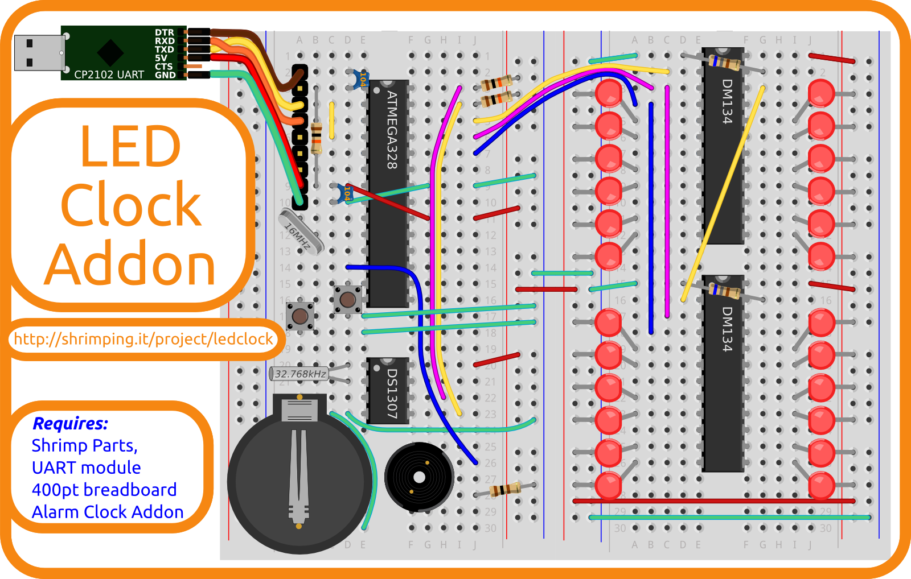

# LED Clock Addon Kit

This is a bagged kit of the project-specific components to build a @ShrimpingIt [LED Clock](../project/ledclock/) following our [step by step build instructions](../project/ledclock/build.html).

## Project Bundle

To make the project, you need the following @ShrimpingIt kits (or equivalent parts you have sourced yourself)...

* This LED Clock Addon kit
* An [Alarm Clock Addon](alarmclock.html) kit
* A [Shrimp Parts](shrimp.html) kit
* <u>Two</u> [400-point breadboards](breadboard400.html)
* A [USB UART](cp2102.html) kit

At the time of writing prepared bundles for the LED Clock project have been priced at £13.80 according to the standard [pricing scheme](../bagging.html) for our bagging service.