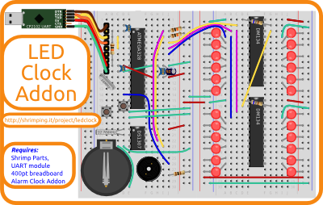

<form style="display:inline;" target="paypal" action="https://www.paypal.com/cgi-bin/webscr" method="post"><input type="hidden" name="cmd" value="_s-xclick"/><input type="hidden" name="hosted_button_id" value="MPUQCH8EKUXH2"/><select name="os0" style="display:inline;vertical-align:center;"><option value="Addon only">£1.50 - LED Clock Addon only</option><option value="Bundle:LEDClock+AlarmClock Addons,Shrimp Parts,2Breadboards+UART">£13.80 - LED Clock Bundle</option></select><input type="hidden" name="on0" value="LED Clock"/><input type="image" src="https://www.paypalobjects.com/en_GB/i/btn/btn_cart_SM.gif" border="0" name="submit" alt="PayPal – The safer, easier way to pay online."/><input type="hidden" name="currency_code" value="GBP"/></form><form style="display:inline;" target="_blank" action="https://www.paypal.com/cgi-bin/webscr" method="post" ><input type="hidden" name="cmd" value="_s-xclick"/><input type="hidden" name="encrypted" value="-----BEGIN PKCS7-----MIIG1QYJKoZIhvcNAQcEoIIGxjCCBsICAQExggEwMIIBLAIBADCBlDCBjjELMAkGA1UEBhMCVVMxCzAJBgNVBAgTAkNBMRYwFAYDVQQHEw1Nb3VudGFpbiBWaWV3MRQwEgYDVQQKEwtQYXlQYWwgSW5jLjETMBEGA1UECxQKbGl2ZV9jZXJ0czERMA8GA1UEAxQIbGl2ZV9hcGkxHDAaBgkqhkiG9w0BCQEWDXJlQHBheXBhbC5jb20CAQAwDQYJKoZIhvcNAQEBBQAEgYCq89dLrxB1HdyR6CoVhllTaq4plZpEIsqwkLNfXsMg1Ose5Fmi9LT1ByTk4oWbWt55SFFAEpzL2HSLVf7PVJMahhfIHTwpjgmWWo8VS/dBc9BJmOoECjup2Q04FsNfYI0oKgoQ8MRxGWyG+Lyd9wNCklqODhfdat8Uusyn0L/ZFjELMAkGBSsOAwIaBQAwUwYJKoZIhvcNAQcBMBQGCCqGSIb3DQMHBAiiVKJuaCsc5YAwC4leIIOXv8Loi2f8czHrHY4llMIUAphK12oZqWLvtpRkc0xWZwTD7dpWg/gx115loIIDhzCCA4MwggLsoAMCAQICAQAwDQYJKoZIhvcNAQEFBQAwgY4xCzAJBgNVBAYTAlVTMQswCQYDVQQIEwJDQTEWMBQGA1UEBxMNTW91bnRhaW4gVmlldzEUMBIGA1UEChMLUGF5UGFsIEluYy4xEzARBgNVBAsUCmxpdmVfY2VydHMxETAPBgNVBAMUCGxpdmVfYXBpMRwwGgYJKoZIhvcNAQkBFg1yZUBwYXlwYWwuY29tMB4XDTA0MDIxMzEwMTMxNVoXDTM1MDIxMzEwMTMxNVowgY4xCzAJBgNVBAYTAlVTMQswCQYDVQQIEwJDQTEWMBQGA1UEBxMNTW91bnRhaW4gVmlldzEUMBIGA1UEChMLUGF5UGFsIEluYy4xEzARBgNVBAsUCmxpdmVfY2VydHMxETAPBgNVBAMUCGxpdmVfYXBpMRwwGgYJKoZIhvcNAQkBFg1yZUBwYXlwYWwuY29tMIGfMA0GCSqGSIb3DQEBAQUAA4GNADCBiQKBgQDBR07d/ETMS1ycjtkpkvjXZe9k+6CieLuLsPumsJ7QC1odNz3sJiCbs2wC0nLE0uLGaEtXynIgRqIddYCHx88pb5HTXv4SZeuv0Rqq4+axW9PLAAATU8w04qqjaSXgbGLP3NmohqM6bV9kZZwZLR/klDaQGo1u9uDb9lr4Yn+rBQIDAQABo4HuMIHrMB0GA1UdDgQWBBSWn3y7xm8XvVk/UtcKG+wQ1mSUazCBuwYDVR0jBIGzMIGwgBSWn3y7xm8XvVk/UtcKG+wQ1mSUa6GBlKSBkTCBjjELMAkGA1UEBhMCVVMxCzAJBgNVBAgTAkNBMRYwFAYDVQQHEw1Nb3VudGFpbiBWaWV3MRQwEgYDVQQKEwtQYXlQYWwgSW5jLjETMBEGA1UECxQKbGl2ZV9jZXJ0czERMA8GA1UEAxQIbGl2ZV9hcGkxHDAaBgkqhkiG9w0BCQEWDXJlQHBheXBhbC5jb22CAQAwDAYDVR0TBAUwAwEB/zANBgkqhkiG9w0BAQUFAAOBgQCBXzpWmoBa5e9fo6ujionW1hUhPkOBakTr3YCDjbYfvJEiv/2P+IobhOGJr85+XHhN0v4gUkEDI8r2/rNk1m0GA8HKddvTjyGw/XqXa+LSTlDYkqI8OwR8GEYj4efEtcRpRYBxV8KxAW93YDWzFGvruKnnLbDAF6VR5w/cCMn5hzGCAZowggGWAgEBMIGUMIGOMQswCQYDVQQGEwJVUzELMAkGA1UECBMCQ0ExFjAUBgNVBAcTDU1vdW50YWluIFZpZXcxFDASBgNVBAoTC1BheVBhbCBJbmMuMRMwEQYDVQQLFApsaXZlX2NlcnRzMREwDwYDVQQDFAhsaXZlX2FwaTEcMBoGCSqGSIb3DQEJARYNcmVAcGF5cGFsLmNvbQIBADAJBgUrDgMCGgUAoF0wGAYJKoZIhvcNAQkDMQsGCSqGSIb3DQEHATAcBgkqhkiG9w0BCQUxDxcNMTUwNTI1MDkzODQwWjAjBgkqhkiG9w0BCQQxFgQUglnra9z7F5Zy9Ois1b1hqZ+mhEgwDQYJKoZIhvcNAQEBBQAEgYAWFAniCOqs+diHC2ERqi7oVaImsduLYIAZWloYZnhn00gSG86kYu2orGwF4ZJ8v3fuSDh9GiFdjQ222x0ULcz/NZ3B17NmCsWybcNlldo/mg2nFW3ZoK5Is++cW0WwMgMi6OIvCTEvtu526Y9SmhzAstKjblCtJX9dxOM13f5wgg==-----END PKCS7-----"/><input type="image" src="https://www.paypalobjects.com/en_GB/i/btn/btn_viewcart_SM.gif" border="0" name="submit" alt="PayPal – The safer, easier way to pay online."/></form>

# LED Clock kits

This is a bagged kit of the project-specific components to build a @ShrimpingIt [LED Clock](../project/ledclock/) following our [step by step build instructions](../project/ledclock/build.html).

## Sourcing Kits and Bundles 

The component and wholesaler information for this project are linked below. Click the ***Add To Cart*** button above for pre-bagged kits from our [retail bagging service](../kit/) to avoid the hassle of self-sourcing.

Our £1.50 ***LED Clock Addon*** includes...

* 2x [DM134 Constant Current LED Driver chips](http://www.aliexpress.com/snapshot/6656454499.html?orderId=67153989449252)
* 2x [680Ω 1/2W Carbon Film Resistor](http://www.taydaelectronics.com/catalogsearch/result/?q=680+OHM+1%2F2W+5%25+Carbon+Film+Resistor)
* 25x [Water Clear Ultrabright Red LEDs](http://www.taydaelectronics.com/led-5mm-red-water-clear-ultra-bright.html)
* 4xRed 4xGreen 2xYellow 2xPurple 2xBlue stripped [22AWG solid core wire](http://www.rapidonline.com/cables-connectors/rapid-1-0-6mm-single-core-equipment-wire-on-100m-reels-62317)

Our £13.80 ***LED Clock Bundle*** includes.

* This LED Clock Addon kit
* An [Alarm Clock Addon](alarmclock.html) kit
* A [Shrimp Parts](shrimp.html) kit
* <u>Two</u> [400-point breadboards](breadboard400.html)
* A [USB UART](cp2102.html) kit

See the [pathways map](/#kit) for a pricing breakdown and to find accessories to build other [@ShrimpingIt projects](/#project) reusing the same components.