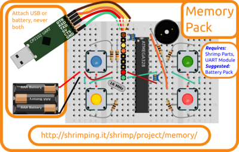

<form style="display:inline;" target="paypal" action="https://www.paypal.com/cgi-bin/webscr" method="post"><input type="hidden" name="cmd" value="_s-xclick"/><input type="hidden" name="hosted_button_id" value="EAF87BJVVEA4L"/><select name="os0" style="display:inline;vertical-align:center;"><option value="Addon only">£2.75 - Memory Game Addon only</option><option value="Bundle: Addon,Shrimp Parts,Breadboards+UART">£12.45 - Memory Game Bundle</option></select><input type="hidden" name="on0" value="Memory Game"/><input type="image" src="https://www.paypalobjects.com/en_GB/i/btn/btn_cart_SM.gif" border="0" name="submit" alt="PayPal – The safer, easier way to pay online."/><input type="hidden" name="currency_code" value="GBP"/></form><form style="display:inline;" target="_blank" action="https://www.paypal.com/cgi-bin/webscr" method="post" ><input type="hidden" name="cmd" value="_s-xclick"/><input type="hidden" name="encrypted" value="-----BEGIN PKCS7-----MIIG1QYJKoZIhvcNAQcEoIIGxjCCBsICAQExggEwMIIBLAIBADCBlDCBjjELMAkGA1UEBhMCVVMxCzAJBgNVBAgTAkNBMRYwFAYDVQQHEw1Nb3VudGFpbiBWaWV3MRQwEgYDVQQKEwtQYXlQYWwgSW5jLjETMBEGA1UECxQKbGl2ZV9jZXJ0czERMA8GA1UEAxQIbGl2ZV9hcGkxHDAaBgkqhkiG9w0BCQEWDXJlQHBheXBhbC5jb20CAQAwDQYJKoZIhvcNAQEBBQAEgYCq89dLrxB1HdyR6CoVhllTaq4plZpEIsqwkLNfXsMg1Ose5Fmi9LT1ByTk4oWbWt55SFFAEpzL2HSLVf7PVJMahhfIHTwpjgmWWo8VS/dBc9BJmOoECjup2Q04FsNfYI0oKgoQ8MRxGWyG+Lyd9wNCklqODhfdat8Uusyn0L/ZFjELMAkGBSsOAwIaBQAwUwYJKoZIhvcNAQcBMBQGCCqGSIb3DQMHBAiiVKJuaCsc5YAwC4leIIOXv8Loi2f8czHrHY4llMIUAphK12oZqWLvtpRkc0xWZwTD7dpWg/gx115loIIDhzCCA4MwggLsoAMCAQICAQAwDQYJKoZIhvcNAQEFBQAwgY4xCzAJBgNVBAYTAlVTMQswCQYDVQQIEwJDQTEWMBQGA1UEBxMNTW91bnRhaW4gVmlldzEUMBIGA1UEChMLUGF5UGFsIEluYy4xEzARBgNVBAsUCmxpdmVfY2VydHMxETAPBgNVBAMUCGxpdmVfYXBpMRwwGgYJKoZIhvcNAQkBFg1yZUBwYXlwYWwuY29tMB4XDTA0MDIxMzEwMTMxNVoXDTM1MDIxMzEwMTMxNVowgY4xCzAJBgNVBAYTAlVTMQswCQYDVQQIEwJDQTEWMBQGA1UEBxMNTW91bnRhaW4gVmlldzEUMBIGA1UEChMLUGF5UGFsIEluYy4xEzARBgNVBAsUCmxpdmVfY2VydHMxETAPBgNVBAMUCGxpdmVfYXBpMRwwGgYJKoZIhvcNAQkBFg1yZUBwYXlwYWwuY29tMIGfMA0GCSqGSIb3DQEBAQUAA4GNADCBiQKBgQDBR07d/ETMS1ycjtkpkvjXZe9k+6CieLuLsPumsJ7QC1odNz3sJiCbs2wC0nLE0uLGaEtXynIgRqIddYCHx88pb5HTXv4SZeuv0Rqq4+axW9PLAAATU8w04qqjaSXgbGLP3NmohqM6bV9kZZwZLR/klDaQGo1u9uDb9lr4Yn+rBQIDAQABo4HuMIHrMB0GA1UdDgQWBBSWn3y7xm8XvVk/UtcKG+wQ1mSUazCBuwYDVR0jBIGzMIGwgBSWn3y7xm8XvVk/UtcKG+wQ1mSUa6GBlKSBkTCBjjELMAkGA1UEBhMCVVMxCzAJBgNVBAgTAkNBMRYwFAYDVQQHEw1Nb3VudGFpbiBWaWV3MRQwEgYDVQQKEwtQYXlQYWwgSW5jLjETMBEGA1UECxQKbGl2ZV9jZXJ0czERMA8GA1UEAxQIbGl2ZV9hcGkxHDAaBgkqhkiG9w0BCQEWDXJlQHBheXBhbC5jb22CAQAwDAYDVR0TBAUwAwEB/zANBgkqhkiG9w0BAQUFAAOBgQCBXzpWmoBa5e9fo6ujionW1hUhPkOBakTr3YCDjbYfvJEiv/2P+IobhOGJr85+XHhN0v4gUkEDI8r2/rNk1m0GA8HKddvTjyGw/XqXa+LSTlDYkqI8OwR8GEYj4efEtcRpRYBxV8KxAW93YDWzFGvruKnnLbDAF6VR5w/cCMn5hzGCAZowggGWAgEBMIGUMIGOMQswCQYDVQQGEwJVUzELMAkGA1UECBMCQ0ExFjAUBgNVBAcTDU1vdW50YWluIFZpZXcxFDASBgNVBAoTC1BheVBhbCBJbmMuMRMwEQYDVQQLFApsaXZlX2NlcnRzMREwDwYDVQQDFAhsaXZlX2FwaTEcMBoGCSqGSIb3DQEJARYNcmVAcGF5cGFsLmNvbQIBADAJBgUrDgMCGgUAoF0wGAYJKoZIhvcNAQkDMQsGCSqGSIb3DQEHATAcBgkqhkiG9w0BCQUxDxcNMTUwNTI1MDkzODQwWjAjBgkqhkiG9w0BCQQxFgQUglnra9z7F5Zy9Ois1b1hqZ+mhEgwDQYJKoZIhvcNAQEBBQAEgYAWFAniCOqs+diHC2ERqi7oVaImsduLYIAZWloYZnhn00gSG86kYu2orGwF4ZJ8v3fuSDh9GiFdjQ222x0ULcz/NZ3B17NmCsWybcNlldo/mg2nFW3ZoK5Is++cW0WwMgMi6OIvCTEvtu526Y9SmhzAstKjblCtJX9dxOM13f5wgg==-----END PKCS7-----"/><input type="image" src="https://www.paypalobjects.com/en_GB/i/btn/btn_viewcart_SM.gif" border="0" name="submit" alt="PayPal – The safer, easier way to pay online."/></form>

# Memory Game kits

The *Memory Game Addon* is a pre-bagged kit containing the extra components needed to for our @ShrimpingIt [Memory Game](../project/memory/) project. This is a breadboard circuit which can be programmed to play simple games with backlit LEDs and melodic tones, a bit like M.B. Games <a href="http://en.wikipedia.org/wiki/Simon_%28game%29" target="_blank">Simon</a> (see this <a href="https://www.youtube.com/watch?v=4YhVyt4q5HI" target="_blank">video of the original</a>).

The Addon combines with the @ShrimpingIt kits described below (or equivalent parts) enabling learners to follow our [step-by-step wiring guide](../project/memory/build.html), and then to upload our [software examples](../project/memory/program.html) using the free Arduino IDE.

## Kits and Bundles

The component and wholesaler information for this project are linked below. Click the ***Add To Cart*** button above for pre-bagged kits from our [retail bagging service](../kit/) to avoid the hassle of self-sourcing.

Our £2.75 ***Memory Game Addon*** includes...
* 1xRed 1xBlue 1xGreen 1xAmber [Backlit Tactile Switches](http://www.aliexpress.com/snapshot/6474229032.html?orderId=65621326219252)
* A ~12mm housed [ Piezoelectric transducer](http://www.aliexpress.com/snapshot/6539329106.html?orderId=66203548719252)
* 5x 100Ω [1/2 Watt resistors](http://www.taydaelectronics.com/10-x-resistor-100-ohm-1-2w-5-carbon-film-pkg-of-10.html)
* 4xGreen 1xRed 1xOrange stripped [22AWG solid core wire](http://www.rapidonline.com/cables-connectors/rapid-1-0-6mm-single-core-equipment-wire-on-100m-reels-62317)

Our £12.45 ***Memory Game Bundle*** includes everything needed to build the project...

* The ***Memory Game Addon*** kit listed above...
* Two [170point Breadboards](breadboard170.html) (to build the circuit on)
* A [Shrimp Parts](shrimp.html) kit (microcontroller and supporting parts)
* A [UART](cp2102.html) kit (for uploading programmed behaviours to your Shrimp)

To run your project from batteries we suggest to add a [3xAAA battery box with switch](http://www.rapidonline.com/Electrical-Power/Battery-Box-3-X-AAA-with-Switch-18-2901) to your order

See the [pathways map](/#kit) for a pricing breakdown and to find accessories to build other [@ShrimpingIt projects](/#project) reusing the same components.