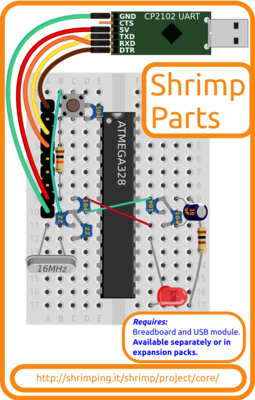

<form style="display:inline;" target="paypal" action="https://www.paypal.com/cgi-bin/webscr" method="post"><input type="hidden" name="cmd" value="_s-xclick"/><input type="hidden" name="hosted_button_id" value="84CFDBHCSHAPS"/><select name="os0" style="display:inline;vertical-align:center;"><option value="Parts only">£4.00 Shrimp Parts only</option><option value="Parts+UART">£7.30 Shrimp Bundle (Shrimp Parts+USB UART)</option><option value="Parts,UART+170ptBreadboard">£8.50 Shrimp Bundle with 170point breadboard</option><option value="Parts,UART+400ptBreadboard">£9.30 Shrimp Bundle with 400point breadboard</option></select><input type="hidden" name="on0" value="Shrimp"/><input type="image" src="https://www.paypalobjects.com/en_GB/i/btn/btn_cart_SM.gif" border="0" name="submit" alt="PayPal – The safer, easier way to pay online."/><input type="hidden" name="currency_code" value="GBP"/></form><form style="display:inline;" target="_blank" action="https://www.paypal.com/cgi-bin/webscr" method="post" ><input type="hidden" name="cmd" value="_s-xclick"/><input type="hidden" name="encrypted" value="-----BEGIN PKCS7-----MIIG1QYJKoZIhvcNAQcEoIIGxjCCBsICAQExggEwMIIBLAIBADCBlDCBjjELMAkGA1UEBhMCVVMxCzAJBgNVBAgTAkNBMRYwFAYDVQQHEw1Nb3VudGFpbiBWaWV3MRQwEgYDVQQKEwtQYXlQYWwgSW5jLjETMBEGA1UECxQKbGl2ZV9jZXJ0czERMA8GA1UEAxQIbGl2ZV9hcGkxHDAaBgkqhkiG9w0BCQEWDXJlQHBheXBhbC5jb20CAQAwDQYJKoZIhvcNAQEBBQAEgYCq89dLrxB1HdyR6CoVhllTaq4plZpEIsqwkLNfXsMg1Ose5Fmi9LT1ByTk4oWbWt55SFFAEpzL2HSLVf7PVJMahhfIHTwpjgmWWo8VS/dBc9BJmOoECjup2Q04FsNfYI0oKgoQ8MRxGWyG+Lyd9wNCklqODhfdat8Uusyn0L/ZFjELMAkGBSsOAwIaBQAwUwYJKoZIhvcNAQcBMBQGCCqGSIb3DQMHBAiiVKJuaCsc5YAwC4leIIOXv8Loi2f8czHrHY4llMIUAphK12oZqWLvtpRkc0xWZwTD7dpWg/gx115loIIDhzCCA4MwggLsoAMCAQICAQAwDQYJKoZIhvcNAQEFBQAwgY4xCzAJBgNVBAYTAlVTMQswCQYDVQQIEwJDQTEWMBQGA1UEBxMNTW91bnRhaW4gVmlldzEUMBIGA1UEChMLUGF5UGFsIEluYy4xEzARBgNVBAsUCmxpdmVfY2VydHMxETAPBgNVBAMUCGxpdmVfYXBpMRwwGgYJKoZIhvcNAQkBFg1yZUBwYXlwYWwuY29tMB4XDTA0MDIxMzEwMTMxNVoXDTM1MDIxMzEwMTMxNVowgY4xCzAJBgNVBAYTAlVTMQswCQYDVQQIEwJDQTEWMBQGA1UEBxMNTW91bnRhaW4gVmlldzEUMBIGA1UEChMLUGF5UGFsIEluYy4xEzARBgNVBAsUCmxpdmVfY2VydHMxETAPBgNVBAMUCGxpdmVfYXBpMRwwGgYJKoZIhvcNAQkBFg1yZUBwYXlwYWwuY29tMIGfMA0GCSqGSIb3DQEBAQUAA4GNADCBiQKBgQDBR07d/ETMS1ycjtkpkvjXZe9k+6CieLuLsPumsJ7QC1odNz3sJiCbs2wC0nLE0uLGaEtXynIgRqIddYCHx88pb5HTXv4SZeuv0Rqq4+axW9PLAAATU8w04qqjaSXgbGLP3NmohqM6bV9kZZwZLR/klDaQGo1u9uDb9lr4Yn+rBQIDAQABo4HuMIHrMB0GA1UdDgQWBBSWn3y7xm8XvVk/UtcKG+wQ1mSUazCBuwYDVR0jBIGzMIGwgBSWn3y7xm8XvVk/UtcKG+wQ1mSUa6GBlKSBkTCBjjELMAkGA1UEBhMCVVMxCzAJBgNVBAgTAkNBMRYwFAYDVQQHEw1Nb3VudGFpbiBWaWV3MRQwEgYDVQQKEwtQYXlQYWwgSW5jLjETMBEGA1UECxQKbGl2ZV9jZXJ0czERMA8GA1UEAxQIbGl2ZV9hcGkxHDAaBgkqhkiG9w0BCQEWDXJlQHBheXBhbC5jb22CAQAwDAYDVR0TBAUwAwEB/zANBgkqhkiG9w0BAQUFAAOBgQCBXzpWmoBa5e9fo6ujionW1hUhPkOBakTr3YCDjbYfvJEiv/2P+IobhOGJr85+XHhN0v4gUkEDI8r2/rNk1m0GA8HKddvTjyGw/XqXa+LSTlDYkqI8OwR8GEYj4efEtcRpRYBxV8KxAW93YDWzFGvruKnnLbDAF6VR5w/cCMn5hzGCAZowggGWAgEBMIGUMIGOMQswCQYDVQQGEwJVUzELMAkGA1UECBMCQ0ExFjAUBgNVBAcTDU1vdW50YWluIFZpZXcxFDASBgNVBAoTC1BheVBhbCBJbmMuMRMwEQYDVQQLFApsaXZlX2NlcnRzMREwDwYDVQQDFAhsaXZlX2FwaTEcMBoGCSqGSIb3DQEJARYNcmVAcGF5cGFsLmNvbQIBADAJBgUrDgMCGgUAoF0wGAYJKoZIhvcNAQkDMQsGCSqGSIb3DQEHATAcBgkqhkiG9w0BCQUxDxcNMTUwNTI1MDkzODQwWjAjBgkqhkiG9w0BCQQxFgQUglnra9z7F5Zy9Ois1b1hqZ+mhEgwDQYJKoZIhvcNAQEBBQAEgYAWFAniCOqs+diHC2ERqi7oVaImsduLYIAZWloYZnhn00gSG86kYu2orGwF4ZJ8v3fuSDh9GiFdjQ222x0ULcz/NZ3B17NmCsWybcNlldo/mg2nFW3ZoK5Is++cW0WwMgMi6OIvCTEvtu526Y9SmhzAstKjblCtJX9dxOM13f5wgg==-----END PKCS7-----"/><input type="image" src="https://www.paypalobjects.com/en_GB/i/btn/btn_viewcart_SM.gif" border="0" name="submit" alt="PayPal – The safer, easier way to pay online."/></form>

# Shrimp Parts kits

The ***Shrimp Parts*** kit is a pre-bagged kit containing the microcontroller and supporting components of the Shrimp layout, central to all our Arduino-compatible [@ShrimpingIt projects](/#project). 

Learners begin with the ultra-minimal [Blink](../project/blink/) which just controls a single LED. The [Protected Build](../project/protected/) adds a few capacitors and buttons for deployment in challenging environments, so your Shrimp can substitute for an Arduino Uno in the tens of thousands of Arduino projects documented online.

For a more advanced example project to get started, combine it with one of our Addon kits to build a [Persistence of Vision](../project/pov/), [Alarm Clock](../project/alarmclock/), [Conductive Keyboard](../project/keyboard/), [Memory Game](../project/memory/) or [LED Clock](../project/ledclock/) following the step by step wiring guides and using our example programs.

## Sourcing Kits and Bundles 

The ***Shrimp Parts*** kit is normally purchased along with a [solderless breadboard](breadboard400.html) to build the circuit and a [USB UART module](cp2102.html) to program the circuit from your computer using the free Arduino IDE.

The component and wholesaler information for this project are linked below. Click ***Add To Cart*** above to buy kits from our [retail bagging service](../kit/). This avoids the hassle, delays and postage costs when sourcing your own.

Our £4.00 ***Shrimp Parts*** kit includes...
* Arduino-Uno-compatible [ATmega328P-PU](http://cpc.farnell.com/1/1/108471-mcu-8bit-avr-32k-flash-28pdip-cpu-speed-20mhz-controller-familyseries-atmega-embedded-interface-type-i2c-spi-uart-mcu-case-style-dip-msl-no-of-ios-23-no-of-pins-28-packaging-each-program-memory-size-32kb-ram-memory-size-2kb-svhc-n-atmega328p-pu-atmel.html) bootloaded microcontroller
* 2x [22pF Ceramic Capacitor](http://www.taydaelectronics.com/10-x-22pf-50v-ceramic-disc-capacitor-pkg-of-10.html)
* 4x [100nF Ceramic Capacitor](http://www.taydaelectronics.com/10-x-0-1uf-50v-ceramic-disc-capacitor-pkg-of-10.html)
* A [10uF Electrolytic Capacitor](http://www.taydaelectronics.com/10uf-25v-105c-radial-electrolytic-capacitor-5x11mm.html)
* A [10KΩ 1/2W Carbon Film Resistor](http://www.taydaelectronics.com/10-x-resistor-10k-ohm-1-4w-5-carbon-film-pkg-of-10.html)
* A [100Ω 1/2W Carbon Film Resistor](http://www.taydaelectronics.com/catalogsearch/result/?q=100+OHM+1%2F2W+5%25+Carbon+Film+Resistor)
* A [16MHz Quartz Crystal](http://www.taydaelectronics.com/16-000-mhz-16-mhz-crystal-hc-49-s-low-profile.html)
* A [Two-pin button](http://www.taydaelectronics.com/tact-switch-6-6mm-5mm-through-hole-spst-no.html)
* A [Water Clear Ultrabright Red LED](http://www.taydaelectronics.com/led-5mm-red-water-clear-ultra-bright.html)
* 1xRed 2xGreen [Stripped solid core 22AWG wire](http://www.rapidonline.com/cables-connectors/rapid-1-0-6mm-single-core-equipment-wire-on-100m-reels-62317)
* A [9-pin header strip](http://www.aliexpress.com/item/100PC-Lot-2-54mm-Pitch-Single-Row-Pin-Header-Pin-Male-Pin-Connector-Length-15mm-Free/688027713.html)

Our £9.30 ***Shrimp Bundle*** includes.

* The ***Shrimp Parts*** kit listed below
* A [400point Breadboard](breadboard400.html) (to build the circuit on)
* A USB [UART module](cp2102.html) (for uploading programmed behaviours to your Shrimp)

See the [pathways map](/#kit) for a pricing breakdown and to find accessories to build  [@ShrimpingIt projects](/#project) using these components. 

If you choose to source your own kits, note the [self-sourcing caveats](../bagging.html). Also please let us know if you have any difficulty with any of the supplier links provided above.