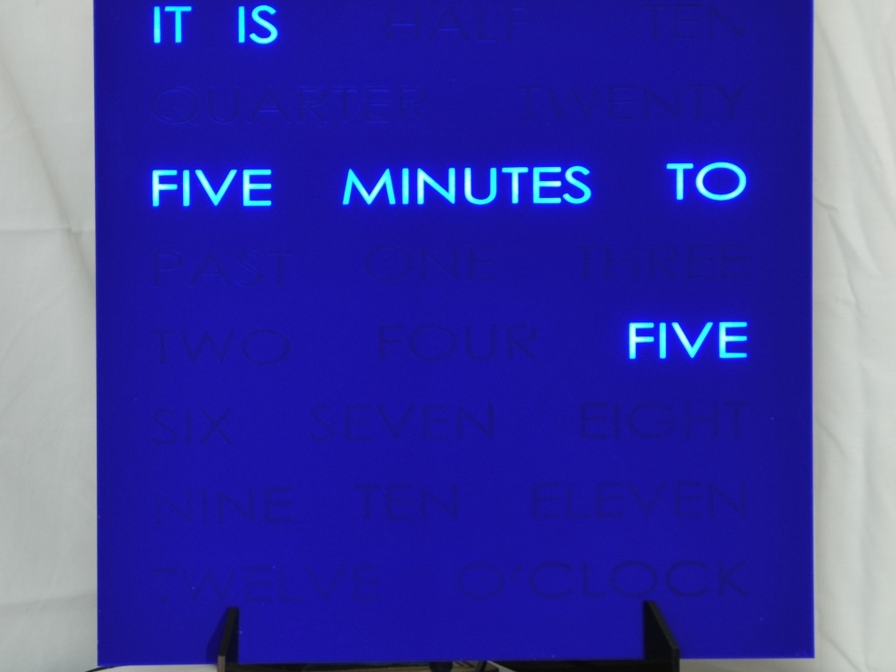

# Alarm Clock

<section>

</section>

A fantastic starting point for any invention which relies on an accurate date and hour, for example controlling a clock display, or triggering events such as alarms by time of day, day of the week or day of the month. Microcomputers often need an extra chip for an accurate time and date. This build demonstrates how to wire up a DS1307 Real Time Clock chip with a coin battery as part of a @ShrimpingIt project.

Begin by following our [step by step build instructions](build.html) then upload the different [example programs](program.html) we have prepared for this project. Example Shrimp behaviours are documented which set and read the accurate time, and which periodically check the time whilst using the lowest possible power, allowing a time-driven invention to be deployed on battery for a long time.