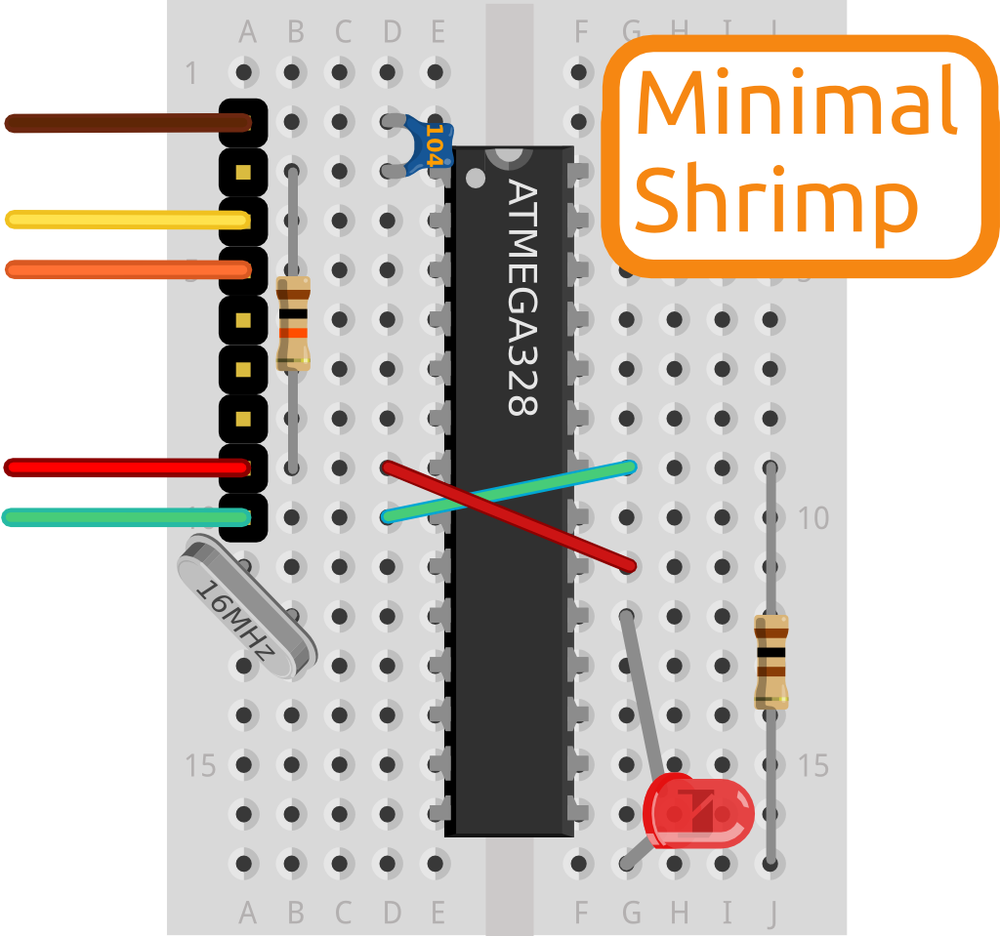
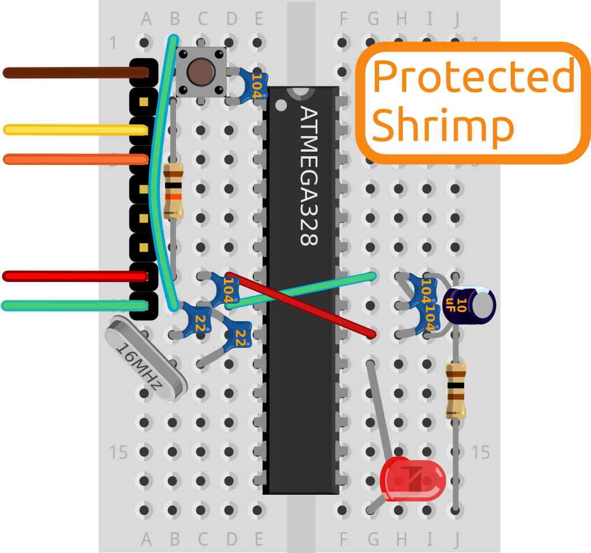

# Blink

<section>

</section>

We use the [Minimal Shrimp build](build.html) at the beginning of all our workshops, and when prototyping for ourselves.

By completing this simplest layout, and proving that we can upload a program called [Blink](http://www.arduino.cc/en/Tutorial/Blink) to control the flashing speed of an LED we know that the foundations are in place for more challenging modules or behaviours, and we can go on to build a [whole world of projects](../../index.html#project).

Visit the [step-by-step build walkthrough](build.html) to get started. Building and programming this circuit can take 20 minutes or so when attempted the first time, plus [troubleshooting](debug.html) if you didn't quite follow the instructions.

Once they have mastered Blink, learners deploying real-world projects with the Shrimp could visit the [Protected Shrimp](../protected/) build page to understand how to make the circuit more robust.