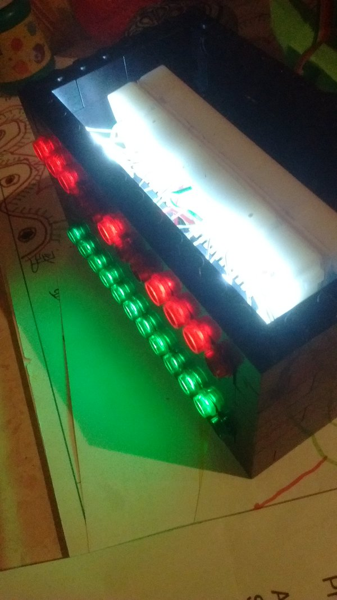
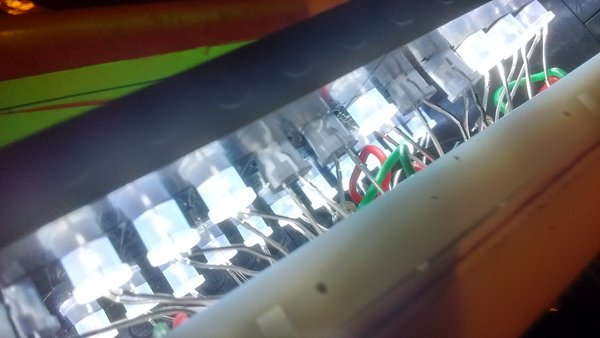
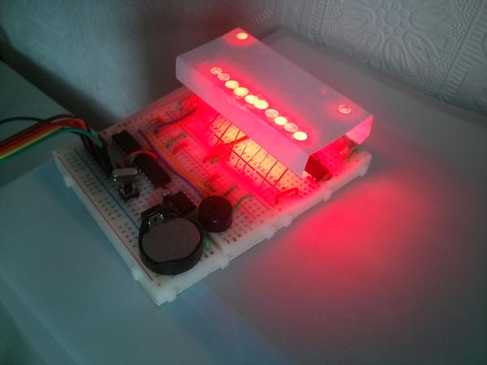

# LED Clock

![An LED Clock][header]

The LED Clock project builds on the [Alarm Clock Project](../alarmclock/), adding a display of the time by illuminating 24 high-powered LEDs.

The time display uses 12 LEDs for the hour, and 12 LEDs for the minutes, so the example pictured shows 2:50pm (2 of 12 hours in one row, and 50 of 60 minutes in the other). 

Click on the project menu above for resources, such as our [step by step wiring instructions](build.html) and example [programmed behaviours](program.html).
<table>
	<tr>
    <td style="width:43%">
    	
        </td>
    <td style="width:57%">
	    
	    
    </td>
    </tr>
</table>
For a more compact build, the two breadboards can be placed back-to-back and housed in Lego.

<blockquote class="twitter-tweet" data-lang="en">
5mm LEDs fit exactly into the 4.8mm voids of Technic LEGO. Who knew? <a href="https://t.co/RHwetyFMbk">https://t.co/RHwetyFMbk</a> <a href="https://t.co/VbkFm2GajQ">pic.twitter.com/VbkFm2GajQ</a>
&mdash; Shrimping It (@ShrimpingIt) <a href="https://twitter.com/ShrimpingIt/status/718518406945861633">April 8, 2016</a></blockquote>

The project can be embedded in a laser-cut housing to produce an ambient time display, or a <a href="http://www.amazon.com/Princess-AAAD7312-LED-Word-Clock/dp/B00JPNWR3G" target="_blank">Word Clock</a> style overlay can be added, showing the time by lighting up words, such as *[It's] [Two] [Fifty] [in the] [afternoon]*

[header]: photos/proto.jpg
[breadboard]: photos/breadboard_version.jpg
[proto_small]: photos/proto_small.jpg
[proto_interior]: photos/proto_interior.jpg
[proto_opened]: photos/proto_opened.jpg