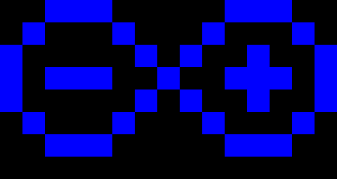

# Example Sketches

You will be able to upload the programs described below to your [Persistence of Vision circuit](build.html) once you have completed [these instructions](../shrimp/program.html) to install the relevant software on your laptop. If they have been properly installed, our sketches should be accessible under File=>Sketchbook=>shrimpingit.

## LED pattern - hard-coded

To start with, let's control the 8 LEDs to produce a static pattern by running the [Pov01PatternFixed](https://github.com/ShrimpingIt/projects/blob/master/sketchbook/shrimpingit/pov/Pov01PatternFixed/Pov01PatternFixed.ino) sketch. 

The key part of the code is shown below, which controls eight digital output pins (which can be on or off) by 'writing' a value of <code class="c">true</code> or <code class="c">false</code>.
<code class="c">
  //turn on selected LEDs
  digitalWrite(9,  true );
  digitalWrite(10, false); 
  digitalWrite(11, true ); 
  digitalWrite(12, false); 
  digitalWrite(A1, true ); 
  digitalWrite(A2, false); 
  digitalWrite(A3, true ); 
  digitalWrite(A4, false); 
</code>

## LED pattern - stored in a variable

Next we will show how the 8 LEDs can produce the same pattern by reading bits from a byte in the [Pov02PatternStored](https://github.com/ShrimpingIt/projects/blob/master/sketchbook/shrimpingit/pov/Pov02PatternStored/Pov02PatternStored.ino) sketch.

The key parts of this code are show below. A byte stores a binary pattern, and each bit of the byte is examined in turn (using [bitwise &](https://www.arduino.cc/en/Reference/BitwiseAnd)) to see if each of the eight lights should be lit. 

<code class="c">
byte pattern = 0b10101010;
</code>

<code class="c">
  //check which 'bits' are set in the byte called 'pattern'  
  digitalWrite(9,    (pattern & 0b00000001) != 0);
  digitalWrite(10,   (pattern & 0b00000010) != 0); 
  digitalWrite(11,   (pattern & 0b00000100) != 0); 
  digitalWrite(12,   (pattern & 0b00001000) != 0); 
  digitalWrite(A1,   (pattern & 0b00010000) != 0); 
  digitalWrite(A2,   (pattern & 0b00100000) != 0); 
  digitalWrite(A3,   (pattern & 0b01000000) != 0); 
  digitalWrite(A4,   (pattern & 0b10000000) != 0); 
</code>

In each case, if the bit ***isn't*** set, then the result of the <code class="c">&</code> operator is 0. The phrase <code>!= 0</code> means 'not equal to zero'.

## LED pattern - using a 'while' loop

Instead of having separate lines of code for every LED, we use a while loop in  [Pov03PatternWhile](https://github.com/ShrimpingIt/projects/blob/master/sketchbook/shrimpingit/pov/Pov03PatternWhile/Pov03PatternWhile.ino).

The key parts of this code are shown below. Instead of explicitly writing eight lots of instructions to query each bit and control each light, we have a single set of instructions, which is executed eight times. 

The code relies on an array containing the pin numbers. A bitCounter is used to count how many bits of the pattern have already been processed. The bitValue starts as 1, then becomes 2, then 4, then 8 and so on, corresponding with each digit of the binary number.
<code class="c">
	int pinNumbers[] = { 9,10,11,12,A1,A2,A3,A4 };
</code>

<code class="c">
	bitCounter = 0;
  	bitValue = 0b00000001;
  	while(bitCounter &lt; totalBits){
        digitalWrite(pinNumbers[bitCounter], (pattern & bitValue) != 0);   
        bitCounter = bitCounter + 1;
        bitValue = bitValue * 2;
	}
</code>

## LED pattern - using a function call

Instead of having the sequence of steps to light the LEDs embedded in routine called 'loop', we put those steps in their own routine, called setLights(...) in [Pov04PatternFunction](https://github.com/ShrimpingIt/projects/blob/master/sketchbook/shrimpingit/pov/Pov04PatternFunction/Pov04PatternFunction.ino)

The key parts of this code are shown below. We've moved the steps which turn on and off the lights into their own routine called, <code>setLights</code> and the steps in <code>loop</code> (which are repeated forever on a loop) tell <code>setLights</code> to execute with a particular pattern.

<code class="c">
void loop() {
  setLights(pattern);
  delay(1);
  setLights(empty);
  delay(2);
}

void setLights(byte pattern){
  bitCounter = 0;
  bitValue = 1;
  while(bitCounter &lt; totalBits){
    digitalWrite(pinNumbers[bitCounter], (pattern &amp; bitValue) != 0); //turn on the LED if the 'pattern' value has that bit set  
    bitCounter = bitCounter + 1;
    bitValue = bitValue * 2;
  }
}
</code>

## LED POV - Painting a sequence of patterns

Previously we were visiting a sequence of bits, and setting the lights to a given pattern. Now we go 'up a level' by doing the same thing for a ***sequence of patterns***. If we upload [Pov05SequenceSmiley](https://github.com/ShrimpingIt/projects/blob/master/sketchbook/shrimpingit/pov/Pov05SequenceSmiley/Pov05SequenceSmiley.ino) and attach a battery pack, then ***waving it in the air should paint a smiley face***.

The key parts of this code are shown below. The byte array called <code>patternSequence</code> contains a series of vertical columns, which make up a smiley face.
<code class="c">
byte patternSequence[] = {
  0b00111100,
  0b01001110,
  0b11011011,
  0b11011111,
  0b11011111,
  0b11011011,
  0b01001110,
  0b00111100
};
</code>

If you inspect the byte array carefully, you can see the image below, tipped to the right (each byte is a vertical column, starting from the left side)...

## LED POV - Painting the Arduino logo

Just for fun, we do the same thing with a different pattern - [the Arduino Logo](https://upload.wikimedia.org/wikipedia/commons/8/87/Arduino_Logo.svg) with our sketch [Pov06SequenceArduino](https://github.com/ShrimpingIt/projects/blob/master/sketchbook/shrimpingit/pov/Pov06SequenceArduino/Pov06SequenceArduino.ino). Of course this is best done with Blue LEDs!
<code class="c">
byte patternSequence[] = {
  0b00111000,
  0b01000100,
  0b10010010,
  0b10010010,
  0b10010010,
  0b01000100,
  0b00101000,
  0b00010000,
  0b00101000,
  0b01000100,
  0b10010010,
  0b10111010,
  0b10010010,
  0b01000100,
  0b00111000
};
</code>

## LED POV - Painting text in the air

Ourlast demonstration sketch is the best. We have exported the 8-bit font information from a Commodore 64 into an Arduino sketch, so that learners can paint their name or choice of message in the air. Simply change the 'message' value in [Pov07PaintText](https://github.com/ShrimpingIt/projects/blob/master/sketchbook/shrimpingit/pov/Pov07PaintText/Pov07PaintText.ino) to choose your own text!

## Exploring our examples

All the code examples for the [POV circuit](build.html) can be browsed on the web at [https://github.com/ShrimpingIt/projects/tree/master/sketchbook/shrimpingit/pov](https://github.com/ShrimpingIt/projects/tree/master/sketchbook/shrimpingit/pov)

# Future developments

Why not add a tilt-switch to 'reverse the polarity' so the circuit can tell whether it is moving from left-to-right or from right-to-left?

Attach a [soldered version](../../kit/stripboard.html) of the circuit securely to a bicycle wheel or wind turbine