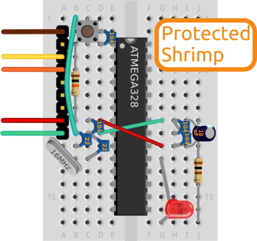

# Protect your Shrimp

Learners who are ready to deploy Shrimp circuits in the wild, and need a Protected Build can begin by building and testing [Blink](../blink/build.html), and then refer to the diagram above for the placement of additional components.

For convenience, [pre-bagged kits](../../kit/shrimp.html) are available to order from @ShrimpingIt online. In fact, all our [Shrimp Parts kits](../../kit/shrimp.html) are shipped with the necessary components for the Protected Shrimp. If you do not wish to buy from us, [information is provided](../../kit/shrimp.html#bom) for you to source commodity parts direct from electronics wholesalers.
