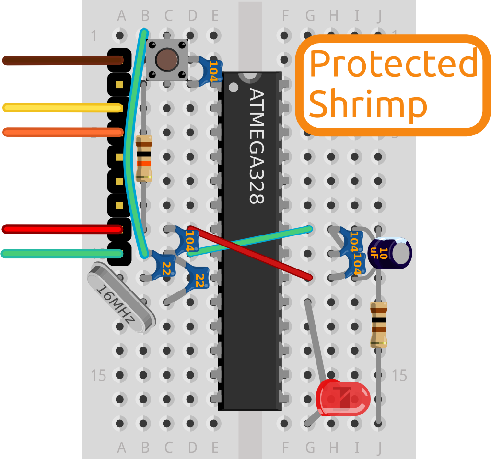

A Shrimp is great for deploying your first interactive inventions, doing physical computing using sensors and actuators. It is programmed using the [Arduino IDE](http://arduino.cc/en/main/software), and thinks it's an [Arduino Uno](http://arduino.cc/en/Main/arduinoBoardUno) but is much cheaper, and teaches more electronics fundamentals. You can use it in a [whole world of projects](http://shrimping.it/blog/arduino-community/).

You make a Shrimp by pushing components into holes in a solderless breadboard. You can [source them yourself](http://shrimping.it/blog/bill-of-materials/)  following our guide, or [buy pre-bagged bundles](http://shrimping.it/blog/kits/) from us.

