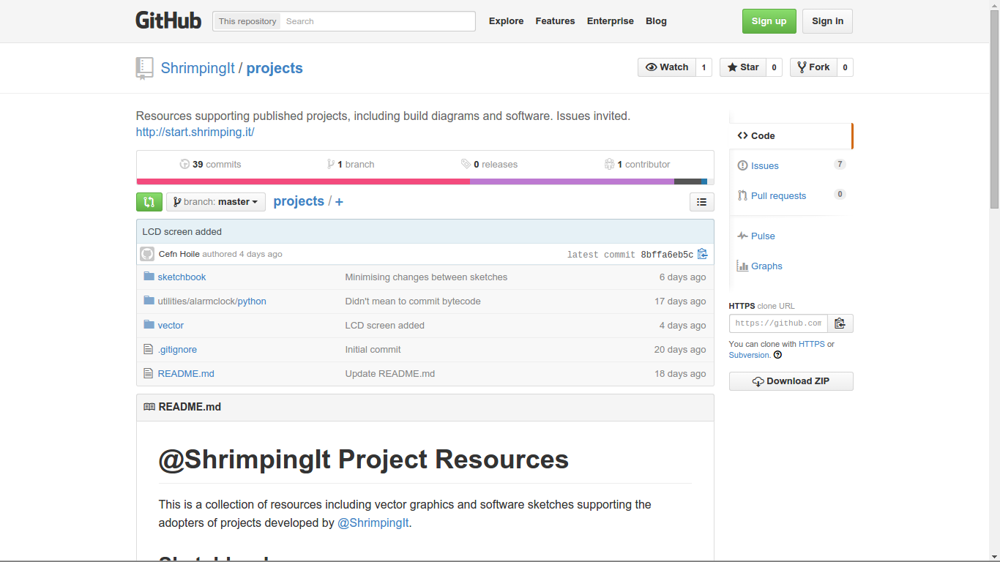
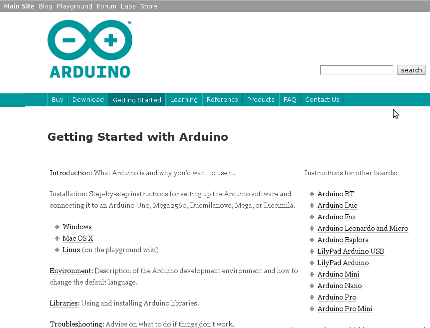
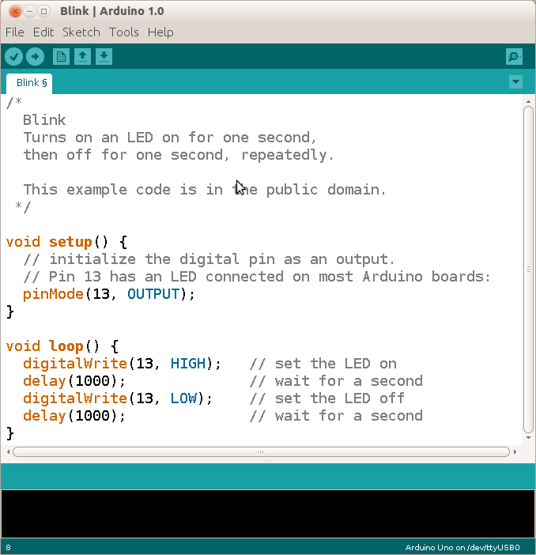

# Programming Shrimps: Configuring your computer

<section>

</section>

Before uploading our Arduino sketches (programs) to a Shrimp circuit, three system-configuration steps are needed (detailed instructions below)...

***1) Download our Sketches***
***2) Install USB Module drivers***
***3) Install Arduino IDE***

After these system configuration steps, launch the **Arduino IDE (Integrated Development Environment)** and use it to...

***4) Select the right Sketchbook, Board and Serial Port***
***5) Upload a Sketch to your circuit***

Once configured, sketches for all our projects should appear in the Arduino IDE under *File=>Sketchbook=>shrimpingit*. 

# 1) Download Our Sketches

Visit the [@ShrimpingIt projects repository](https://github.com/ShrimpingIt/projects) to find a folder containing the programs and libraries for all our @ShrimpingIt projects, intended for the [Arduino IDE](http://www.arduino.cc/en/Main/Software)  version 1.6.3 or above. If you have never used *git* simply click on the Zip button to download a snapshot of the git repository and double-click on it to unzip the archive to a location of your choice.

# 2) Install USB module drivers

CP2102 module drivers are available for for...

* [Mac OS 10.4 and above](http://shrimping.it/drivers/cp2102/macos/10.4-10.9_newer_untested/Mac_OSX_VCP_Driver.zip)
* [Windows 8](http://shrimping.it/drivers/cp2102/windows/windows-8-silabs/CP210x_VCP_Windows.zip), [Windows XP, Vista, 7](http://shrimping.it/drivers/cp2102/windows/xp-vista-win7-silabs/CP210x_VCP_Win_XP_S2K3_Vista_7.exe)

After installing new drivers, it is a good idea to restart your machine to ensure everything works.

Linux distributions include built-in CP2102 drivers, although Linux user accounts may need membership of the 'dialout' or 'serial' permission groups to access the device.

If your machine is running an old or specialist operating system, then browse [http://shrimping.it/drivers](http://shrimping.it/drivers) or the [Silabs driver page](https://www.silabs.com/products/mcu/Pages/USBtoUARTBridgeVCPDrivers.aspx) to find alternate driver versions.

# 3) Install Arduino IDE

We use an unmodified Arduino IDE to upload programs to the Shrimp. Instructions for installing the Arduino IDE are available for...

* [Linux](http://playground.arduino.cc/Learning/Linux)
* [Mac OS](http://arduino.cc/en/Guide/MacOSX)
* [Windows](http://arduino.cc/en/Guide/Windows)

# 4) Select the right Sketchbook, Board and Serial Port

Click on *File=>Preferences* in the menu of the Arduino IDE, then click 'Browse' to choose your "Sketchbook Location". Navigate to our projects repository you unzipped in step one and select the folder called 'sketchbook'. ***Then close all Arduino IDE windows, then restart the Arduino IDE***.

A Shrimp is binary- and pin-compatible with an Arduino Uno. Click on 'Arduino Uno' under *Tools=>Boards* in the Arduino IDE. A dot should appear next to 'Arduino Uno' to show the right configuration is selected.

Closing and reopening the *Tools=>Serial Ports* menu in the Arduino IDE refreshes its list of known serial ports. If you have completed step 2 properly, a new serial port should appear in the menu soon after you plug the CP2102 into a USB port, and it should disappear when you unplug it. Click on that 'serial port' to select it. A tick should appear next to the port to indicate that the Arduino IDE will use it for uploading programs and serial monitoring. Linux and Mac machines have port names like "/dev/ttyUSB0". Windows machines have serial port names like "COM1" and "COM2". In some Linux systems a new serial port is allocated every time you unplug and replug, so sadly you have to reselect it every time.

# 5) Upload a Sketch to your circuit

To run any of the sketches on your Shrimp you need to find it under *File=>Sketchbook=>shrimpingit* and click on it. Once the code appears in the editor you can click on *File=>Upload*, hit *CTRL+U* or click the 'Right Arrow' symbol in the top menu bar to send it to your Shrimp.

Eventually it should report 'Done Uploading' **without any red error text** appearing at the bottom and your circuit should start performing. 

# Troubleshooting

If Red error text is appearing at the bottom when you upload a Sketch, it could be... 

* A ***compiler*** error; probably something wrong with the installation of our sketchbook and libraries. Check you are using a version of Arduino IDE of 1.6.3 or above. If so, then revisit step 1 and the first part of step 4. 
* An ***error in USB module configuration***. If the Serial Port with the tick next to it appeared and disappeared properly in step 4 then the USB module is probably configured OK, otherwise revisit step 2 and the last part of step 4. 
* If there's an ***upload error*** check you have selected *Tools=>Boards=>Arduino Uno* in the second part of step 4. If there is still a problem, then probably your circuit doesn't correspond exactly with the diagram. Re-check the position and orientation of all the components, then try our [circuit troubleshooting steps](../blink/debug.html). 

If you still need our help, [get in touch](../../contact.html) and...
* email well-focused close-ups of your circuit from a few angles
* describe in prose ***what happens*** when you try to complete the step you're stuck on.