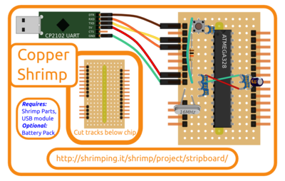

# Wiring a Stripboard Project

Projects already proven on [breadboard](../../kit/breadboard400.html) can be transferred to an identical layout on the copper tracks of a [stripboard](http://en.wikipedia.org/wiki/Stripboard) material by cutting the horizontal copper tracks at the back of the stripboard so they replicate the rails of the breadboard.

For convenience, pre-bagged [retail kits](../../kit/stripboard.html) including stripboard, header pins and chip holders are available to order from @ShrimpingIt online.

If you do not wish to buy from us, [information is provided](../../kit/stripboard.html#bom) for you to source commodity parts direct from electronics wholesalers.

# Getting Started

Familiarise yourself with the [fundamentals](../shrimp/index.html) of shrimp projects, and prototype the project on solderless breadboard first. Wiring errors or other conceptual errors in the organisation of the circuit are hard to remedy once it’s soldered, and most of these will be ironed out by completing a breadboard build.

This page outlines how to build the stripboard version of the [Shrimp](../shrimp/), and also contains the detail of how source the parts direct for your own kits if you want to buy them for your school or hackspace.

Before trying to transfer your working circuit to stripboard, the stripboard should be prepared by using a [dedicated spot-cutter](http://www.maplin.co.uk/spot-face-cutter-1926), turning a 4mm drill bit by hand or using a strong stanley knife to remove small areas of copper found at the rear, to create two separate sets of parallel copper rails, in the same arrangement of rows provided by one of the [mini 170 point breadboards](../../kit/breadboard170.html) we use.

You can get a feel for this by placing the chip socket through from the non-coppered side. There should be no copper connecting the two rows of pins after you’ve soldered the socket in, so you must do some surgery to separate the single copper rail into two.

The diagram above shows the relative position of the spot cuts as seen from above. (the non-coppered side), but the spot cuts are actually done to the back of the board, where the copper is.

Find a hole in each track where you want to separate the tracks. The drill should be turned using this as a centering hole until the continuous copper track has been separated in two. Be sure there are no traces of copper still connecting the two sides, and no traces shorting the parallel tracks together. If using a stanley knife, run it along deeply into the fibreglass in two parallel lines and peel off the copper which remains between those lines.

Once you’ve prepared your board, simply add your components following the diagram above. The components should be placed through the board from the non-coppered side. Please click on the diagram to see it larger. When in place, solder them from the rear (the coppered side). A fantastic soldering guide can be found at [this link](http://mightyohm.com/files/soldercomic/FullSolderComic_EN.pdf) to help you.

You may want to experiment with soldering some wire or something disposable first. The kits we provide have a stripboard area roughly three times larger than that needed for the Shrimp itself, so there’s plenty of room for experimentation and expansion.

After completing the soldered circuit it should be identical to the breadboarded version, so everything you’ve learned from your breadboard experiments should transfer directly. Good luck, and get in touch if there’s anything which needs to be clarified, or anything else we can help with.

