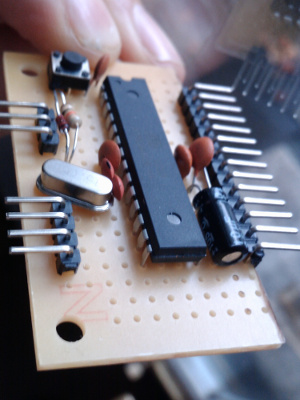

# Stripboard Shrimp Projects

@ShrimpingIt provides [retail kits](../../kit/stripboard.html) and a brief [guide](build.html) so learners can make their circuits more robust using [Stripboard](http://en.wikipedia.org/wiki/Stripboard). All of the Shrimp projects we describe, and many more, can be made robust by soldering them onto this versatile material.
