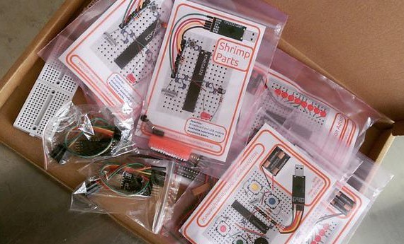
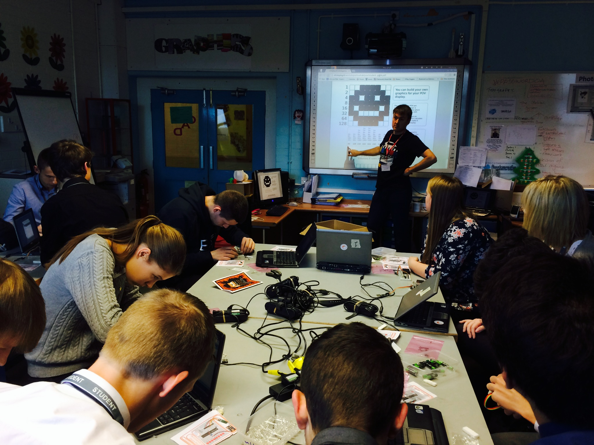
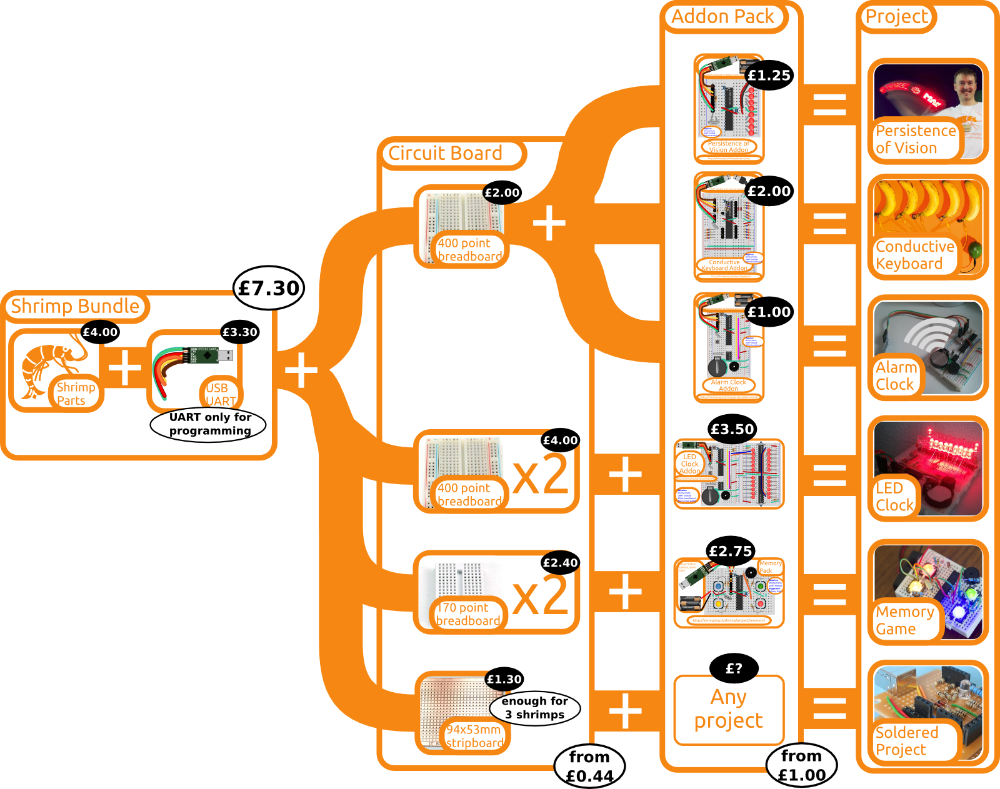

# @ShrimpingIt Teacher Training - 1st and 2nd July 2016

### Duration: 2 Days / Cost: £100

@ShrimpingIt designs cheap, accessible devices for UK educators and learners to prototype and program in the classroom or home, which begin by [making their own ](/project/blink/) simple Arduino-compatible computer on solderless breadboard.

Hosted at @ShrimpingIt's new Morecambe headquarters, this one-to-two day event provides a comprehensive introduction to the use of our prototyping projects in UK classrooms. 

The course is designed to serve teachers' professional development needs and is restricted to educators, facilitators and leaders of after-school clubs. 

All three **learner @ShrimpingIt kits** and our new **sensor pack** are included (equivalent retail price £18.25).

## Background

By creating their own projects from scratch with prototyping materials, learners are exposed to more STEM fundamentals and maker skills. Educators are not limited by pre-designed printed circuit boards, and have greater flexibility to add their own sensors and actuators to suit their subject needs or cross-curricular experimentation.

Our fun, accessible and STEM-rich projects are supported by step-by-step documentation, example code and sourcing guides or pre-bagged kits. Lesson plans are available to use our prototypes to enrich Computing, D&T and STEM subjects. By using cheap commodity electronics, two full project kits can be provided to learners for approximately the price of a single Microbit!

# Summary Agenda

Day 1) teachers are guided through our three @ShrimpingIt learner builds conceived for UK education, including corresponding lesson plan progressions and term projects based on each build.

Day 2) (optional) teachers are invited to conceive and lead a prototype design for their classroom, drawing upon our extensive workshop tools and parts and directly supported in circuit and software design by @ShrimpingIt. 

Following the event, support will be offered to ongoing projects via Twitter @ShrimpingIt, email or video link.

# Learner Projects

All @ShrimpingIt projects have been conceived for classroom and workshop use, but lesson plan progressions are maintained specifically for three projects;

* **Persistence of Vision** - a common starting point for our @ShrimpingIt community workshops. It follows on from the **Blink** build by adding a column of 8 LEDs to produce a visual illusion, painting pixelated text and images in the air as you wave it.
* **Conductive Keyboard** - a reverse-engineered version of the ever-popular MakeyMakey, but built with a handful of resistors and a hacked USB wire, allows a rich landscape of entertaining interactive systems to be triggered by human touch and wired by crocodile clips
* **Alarm Clock** - augments the Shrimp circuit with a 'Real Time Clock' circuit, keeping an accurate reference time for a clock display for sensor logging or other time-driven behaviours, such as our Lego RGB Unary Clock [recently featured on Hackaday](http://hackaday.com/2016/05/14/unary-clock-for-the-binary-challenged/)

# Get in touch

If you would like to be signed up for our Teacher training event, just [get in touch](contact.html) and we will send a Paypal invoice or Proforma invoice payable by cheque or BACS from a school account.

